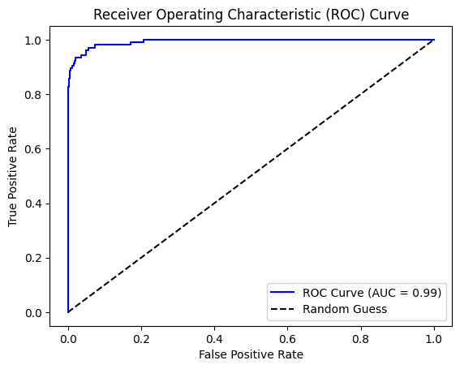

# **Predicting Loan Approvals Using Neural Networks**

## **Overview**

This project develops a machine learning model using a neural network to predict whether a customer will be approved for a personal loan. The project includes stages such as data preparation, visualization, model design, evaluation, and improvements.

---

## **Table of Contents**

1. [Introduction](#introduction)
2. [Data Preparation](#data-preparation)
3. [Data Visualization](#data-visualization)
4. [Neural Network Design](#neural-network-design)
5. [Model Evaluation](#model-evaluation)
6. [Challenges](#challenges)
7. [Improvements](#improvements)
8. [Conclusion](#conclusion)

---

## **Introduction**

The primary objective of this project was to develop a machine learning algorithm using a neural network to predict whether a customer would be approved for a personal loan. This binary classification task utilized a dataset containing demographic and financial features of 5,000 customers, with the target variable being `Personal Loan` (1 for approved, 0 for not approved).

The project involved multiple stages:

- Data cleaning and preparation
- Data visualization
- Neural network design
- Model evaluation

---

## **Data Preparation**

### **Steps Taken**

1. **Irrelevant Features Removed**:
   - Dropped `ID` and `ZIP Code` as they provided no predictive value.
2. **Missing Values**:
   - Checked for missing data; none were found.
3. **Feature Scaling**:
   - Normalized numerical features (`Age`, `Experience`, `Income`, `CCAvg`, `Mortgage`) using `StandardScaler` to ensure equal contribution to model training.
4. **Train-Test Split**:
   - Split data into training (80%) and testing (20%) subsets.

---

## **Data Visualization**

### **Feature Distributions**

This plot shows the distributions of key numerical features, including `Income` (right-skewed), `CCAvg`, and `Mortgage`.

### **Correlation Heatmap**

The correlation heatmap reveals relationships between features. Higher income, advanced education levels, and higher credit card usage correlate positively with loan approval.

---

## **Neural Network Design**

### **Architecture**

1. **Input Layer**:
   - 11 input features after preprocessing.
2. **Two Hidden Layers**:
   - First layer: 64 neurons, ReLU activation, L2 regularization (`l2=0.01`), Dropout (`rate=0.3`).
   - Second layer: 32 neurons, ReLU activation, L2 regularization (`l2=0.01`), Dropout (`rate=0.3`).
3. **Output Layer**:
   - Single neuron with sigmoid activation for binary classification.

### **Compilation**

- **Optimizer**: Adam
- **Loss Function**: Binary cross-entropy
- **Metrics**: Accuracy

---

## **Model Evaluation**

### **Training Results**

![Training vs Validation Loss]

- **Early Stopping**:
  - Halted training after 39 epochs when validation loss stopped improving.
- **Validation Accuracy**: Reached 97.3%.

### **Confusion Matrix**

The confusion matrix highlights the model's strong performance with:

- True Positives: 88
- True Negatives: 893
- False Positives: 17
- False Negatives: 2

### **ROC Curve**

The ROC curve demonstrates the model's excellent ability to distinguish between classes, with an **AUC score of 0.99**.

---

## **Challenges**

1. **Feature Scaling**:
   - Ensured numerical features contributed equally during training.
2. **Class Imbalance**:
   - Slight imbalance with more non-loan approvals than loan approvals.

---

## **Improvements**

1. **Hyperparameter Tuning**:
   - Experiment with different numbers of neurons, learning rates, and dropout rates to further optimize the model.
2. **Regularization Adjustment**:
   - Test stronger or weaker L2 regularization to assess its impact.
3. **Threshold Optimization**:
   - Adjust the classification threshold (default 0.5) to improve recall or precision based on business objectives.
4. **Explainability**:
   - Use tools like SHAP or LIME to identify which features most significantly influence predictions.

---

## **Conclusion**

The neural network successfully predicted loan approvals with high accuracy, precision, and recall. This project demonstrated the importance of thorough data preprocessing, careful neural network design, and robust performance evaluation.

Additional research into the ROC curve and AUC validated the model's ability to generalize across varying thresholds, further supporting its robustness. With potential enhancements, the model could be refined further to provide even more robust predictions.

---
